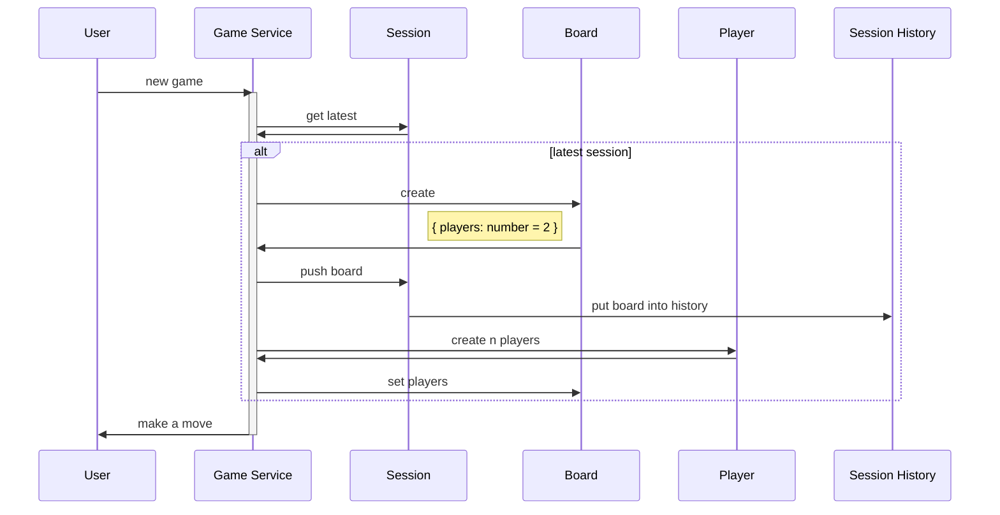
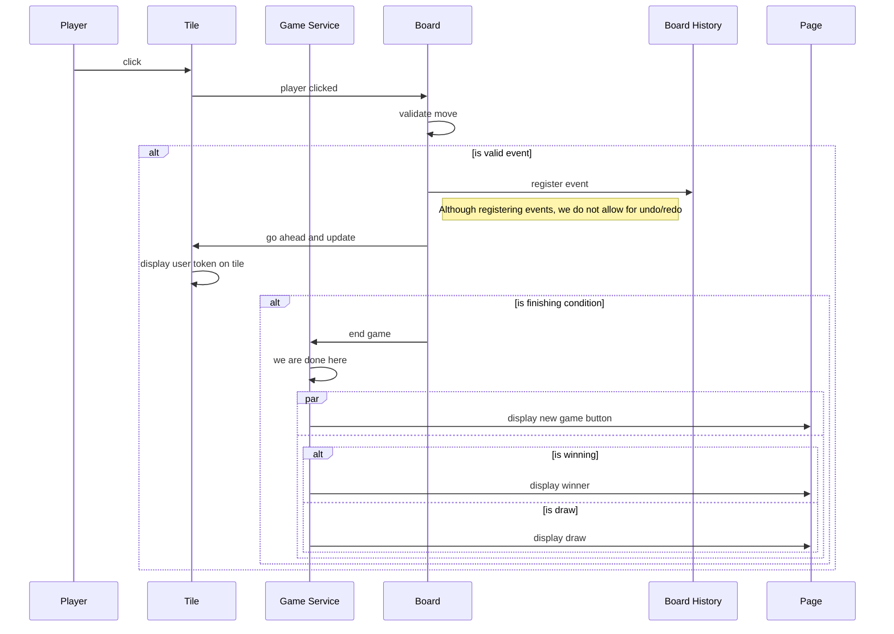

# Tic Tac Toe

#### Considerations

- Game service is an aggregator that keeps track of session, board and players
- Events and models are persisted as soon as possible
- First imperatively, then test-driven

#### TODO
- [ ] Drop yarn support in favor of pnpm
- [ ] Make matrix in workflow use a glob pattern for packages/*

#### Tasks
- Getting started
    - [x] Create README.md
    - [x] Add git actions
    - [x] Deploy to surge.sh
- Imperatively
    - Playing
        - [x] Create models
        - [ ] Create localforage adapter
        - [ ] Create service
        - [ ] Create tile component
        - [ ] Create player turn component
        - [ ] Create board component
        - [ ] Enable starting a game
        - [ ] Enable making a move
        - [ ] Enable winning a game
        - [ ] Enable drawing a game
        - [ ] Enable saving unfinished games
        - [ ] Enable starting a game after finishing
        - [ ] Enable checking for a draw before finishing
        - [ ] Enable players to choose their tickers
        - [ ] Enable players to choose their names
        - [ ] Enable more than two players
        - [ ] Enable more than 3x3 boards
    - Checking sessions' games
        - [ ] Create session plp
        - [ ] Create session pdp
        - [ ] Enable continuing an unfinished game
    - Checking games' history
        - [ ] Create game plp
        - [ ] Create game pdp
        - [ ] Enable replaying the moves
        - [ ] Enable controlling speed of replay
- [ ] Add typescript
- [ ] Add eslint
- [ ] Add prettier
- [ ] Add git hooks
- [ ] Create monorepo with pnpm
- [ ] Extract what can be extracted from imperative
    - Maybe as addon?
    - Can models and services be declared from outside an ember project and be used in this same project without having to declare a file for it?
- TDD
    - Playing
        - [ ] Create models
        - [ ] Create localforage adapter
        - [ ] Create service
        - [ ] Create tile component
        - [ ] Create player turn component
        - [ ] Create board component
        - [ ] Enable starting a game
        - [ ] Enable making a move
        - [ ] Enable winning a game
        - [ ] Enable drawing a game
        - [ ] Enable saving unfinished games
        - [ ] Enable starting a game after finishing
        - [ ] Enable checking for a draw before finishing
        - [ ] Enable players to choose their tickers
        - [ ] Enable players to choose their names
        - [ ] Enable more than two players
        - [ ] Enable more than 3x3 boards
    - Checking sessions' games
        - [ ] Create session plp
        - [ ] Create session pdp
        - [ ] Enable continuing an unfinished game
    - Checking games' history
        - [ ] Create game plp
        - [ ] Create game pdp
        - [ ] Enable replaying the moves
        - [ ] Enable controlling speed of replay

#### Starting the application

#### Starting a game

#### A move

#### Relationships

